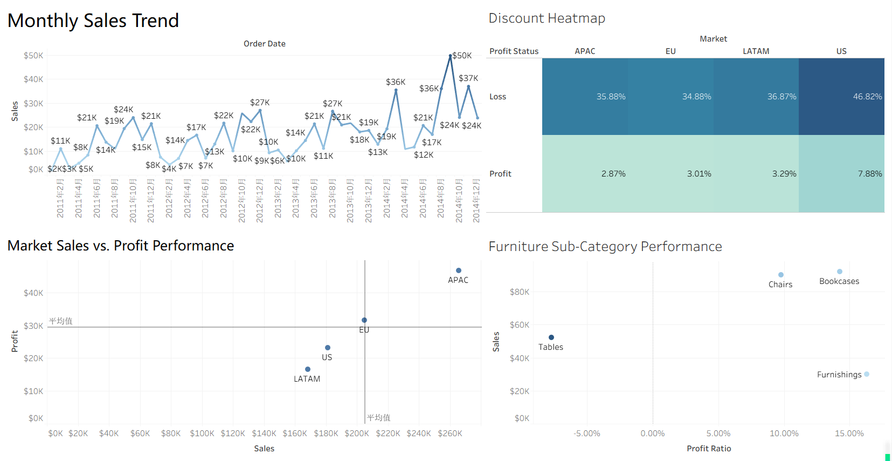

# Global Sales Performance Analysis

## Project Overview

This project analyzes global sales and profitability performance across different markets. The dashboard explores sales trends over time and examines how profitability varies across markets and product sub-categories, with a particular focus on the relationship between discount levels and profit performance.

## Dashboard

